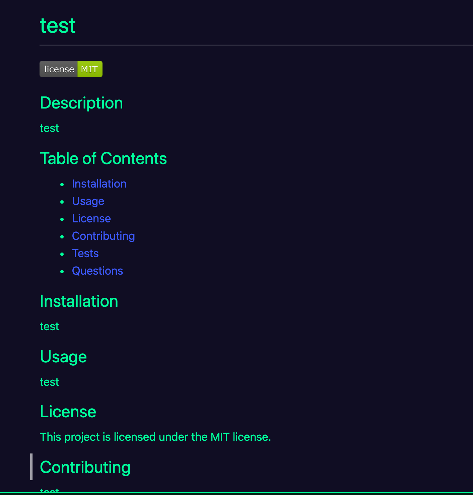

 # Readme-Generator

## Description 
This command line application allows developers to generate a professional README.md file for their repository. The user will be prompted with an array of questions where they will input information about their project. After the user answers all of the questions, they will have a professional README.md file generated with the title of their project and sections entitled: Description, Table of Contents, Installation, Usage, License, Contributing, Tests, and Questions.

## Table of Contents  
* [Installation](#installation)
* [Usage](#usage)
* [License](#license)
* [Contributing](#contributing)
* [Tests](#tests)
* [Questions](#questions)

## Installation
This generator requires the user to install node.js and then the inquirer dependency.

## Usage 
Run the code through the terminal. Use the command "node index.js" to prompt the questions used to generate the README.md file.

## License
This project is licensed under the Apache license.

## Contributing
To contribute to this project you can fork this GitHub repository.

## Tests
To run tests for this application you can run the command "npm test" in your terminal. 

## Questions
If you have any additional questions about this application you can reach out to me at briannahebeler@gmail.com.
You can check out some of my other projects at briannahebeler (https://github.com/briannahebeler).
